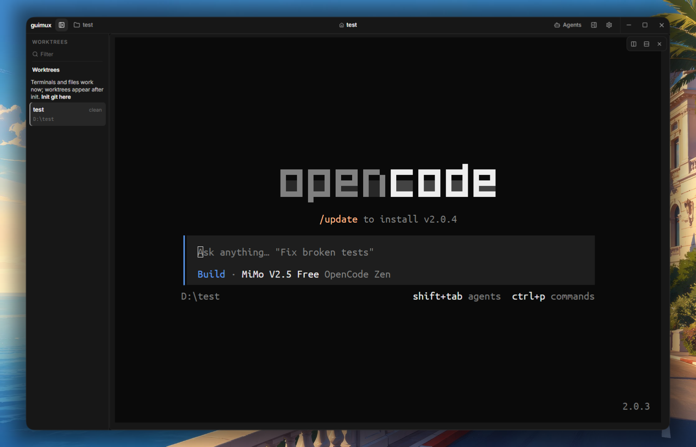

# guimux

Lean Tauri 2 + React worktree/terminal workbench.



> **Early beta.** This project is actively under development. Expect bugs, glitches, and missing features. Things will break.

Pull requests are welcome — open one and the author will review and merge.

## Run

```bash
npm install
npm run dev          # frontend only
npm run tauri dev    # full app
```

## Build

```bash
npm run tauri build
```

## Updates

Guimux self-updates via the Tauri updater plugin + GitHub Releases.
No update server: the app polls `latest.json` from the latest release.

```text
git tag v0.1.2 → GitHub Actions → tauri build → sign → latest.json
  → Release → installed Guimux detects → download → verify → install → restart
```

Settings › Updates: auto-check toggle (default on), Check for Updates,
Download & Install, Restart to Update. One startup check per launch;
failures never block the app.

Release checklist:

- `TAURI_SIGNING_PRIVATE_KEY` secret must hold the minisign private key
  matching `plugins.updater.pubkey` in `src-tauri/tauri.conf.json`.
  Generate: `npx tauri signer generate -w <secret-path>` (never commit it).
- Tag `v*` → `.github/workflows/release.yml` builds win/mac/linux,
  signs artifacts, uploads `latest.json` to the release.
- Validate: `node scripts/validate-updater-manifest.mjs <latest.json> <version>`.
- E2E: install 0.1.1, publish v0.1.2, launch 0.1.1 → Settings › Updates
  shows 0.1.2 → install → restart → state (projects/worktrees/settings) intact.

## What it does

- **Worktrees** — list / create / remove / merge branches
- **Terminal splits** — GPU-accelerated xterm.js, unlimited h/v splits per worktree
- **File explorer + editor** — Monaco with autosave
